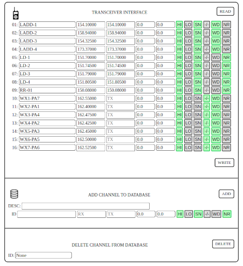

# tk2402_radio_programmer

## Introduction
This software was developed to field program the Kenwood 2402 VHF radio via serial protocol. The software handles all handshaking, encryption, and data formatting between the host computer and the transceiver. A local web interface is provided, along with a PostgreSQL database of user-supplied channel frequencies and paramters.

The intention was to have a portable VHF field programmer running on a _raspberry pi_, with access to the web interface via phone / tablet / laptop. However, this software can can be run direcly on any system with the requirements indicated in this document.

## Disclaimer
*tk2402_radio_programmer* directly overwrites the contents of the TK2402's integrated EEPROM. **This software is strictly for educational and research purposes, and has the potential to render your radio unusable and void any warranty.** I assume no responsibility or liability for any damages or loss of use to property. Use this software at your own risk. This software may not be used for any commercial application. 

## Hardware Requirements
- Kenwood TK 2402 (I suspect this may work with other 2400 / 3400 series handheld radios, but has not been tested on any other model by the developer).  **Please see Disclaimer**.
- Prolific USB-to-Serial cable with appropriate Kenwood-style two-pin connector.

## Technologies / Frameworks
- Python 3.6
- Flask
- Javascript
- PostgreSQL 9

## Installation
Clone the repository and install all python package requirements listed in [requirements.txt](requirements.txt).  It is recommended that a new Python virtual environment is created for this purpose. In a Linux environment, these requirements can be installed with the following command:  
`pip install -r requirements.txt`
#### Database Setup
Install PostgreSQL and create a database with the structure provided in [pg_dump.sql](pg_dump.sql).  This dump file can be reconstituted with the pg_restore command provided with PostgreSQL.
As structured, the database should be named "kenwood" with default username "postgres" and password "postgres".  If you wish to use custom credentials, the connection properties can be changed in [kenwood_interface.py](kenwood_interface.py#L14).

## Launch
To launch the application, run the script [kenwood_interface.py](kenwood_interface.py).  
`python3 kenwood_interface.py`  
This will start a Flask development server on your host computer at 0.0.0.0 port: 5050.  

Navigate to the host address and port from any browser with network access to the server.
> <yourhostname/IP>:5050
