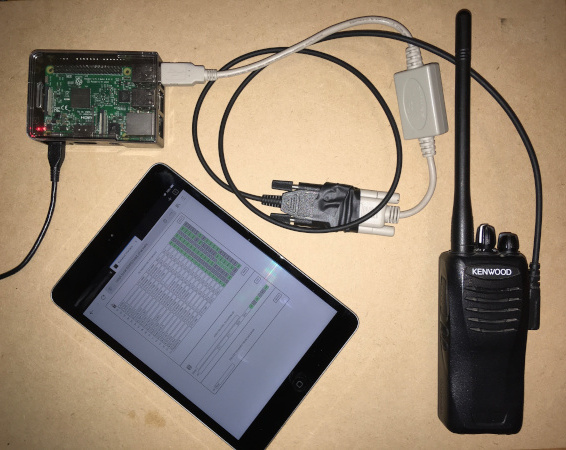

# tk2402_field_programmer

## Introduction
**TK2402 Field Programmer** is a custom field programmer for Kenwood model TK-2402 VHF radios. The software handles all handshaking, data encryption, channel / frequency formatting, EEPROM memory management, and serial communications between a host computer and the transceiver. The software includes a local web-based UI and a SQLite3 database to configure and store user-supplied frequencies and parameters.

The intention was to have a portable VHF field programmer running on a _raspberry pi_, with access to the web interface via phone / tablet / laptop. However, this software can be run directly on any system with the requirements indicated in this document.

## Disclaimer
**This software is strictly for educational and research purposes and has the potential to render your radio unusable and void any warranty.**  

*tk2402_field_programmer* directly overwrites the contents of the TK2402's integrated EEPROM.  The author assumes no responsibility or liability for any damages or loss of use to property. Use this software at your own risk. This software should not be used for any commercial or mission-critical applications. 

## Hardware Requirements
- Kenwood TK 2402 VHF transceiver (I suspect this may work with other 2400 / 3400 series handheld radios, but has not been tested on any other model by the author).  **Please see Disclaimer**.
- Prolific USB-to-Serial cable with appropriate Kenwood-style two-pin connector.

## Technologies / Frameworks
- Python 3.x
- Flask
- Javascript
- SQLite3

## Installation
Clone the repository and ensure that all python packages listed in [requirements.txt](requirements.txt) are installed.  It is recommended that a new python virtual environment is created for this purpose. On a Linux machine, these requirements can be installed with the following command:  
`pip install -r requirements.txt`

## Launch
To launch the application, run the script [kenwood_interface.py](kenwood_interface.py). This will start a Flask development server on your host computer at 0.0.0.0 port: 5050.  
`python3 kenwood_interface.py`  

Navigate to the host address and port from any browser with network access to the server.
From a browser on the server running the application, the address would be:  
`http://localhost:5050`  or  `http://127.0.0.1:5050`

From another computer in the same local network, that address would have the format:  
`http://<yourhostname>:5050` 
